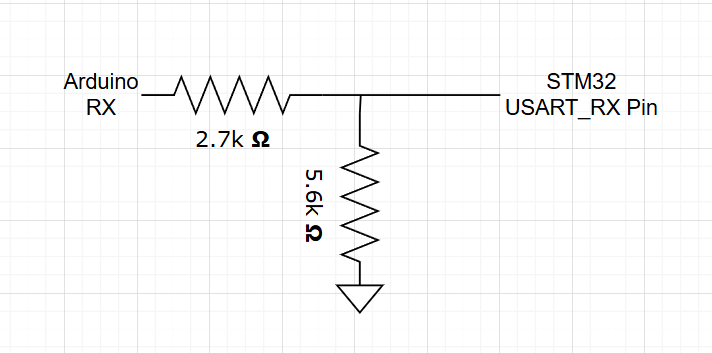
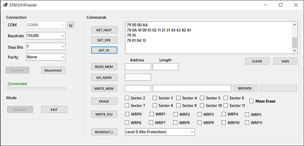
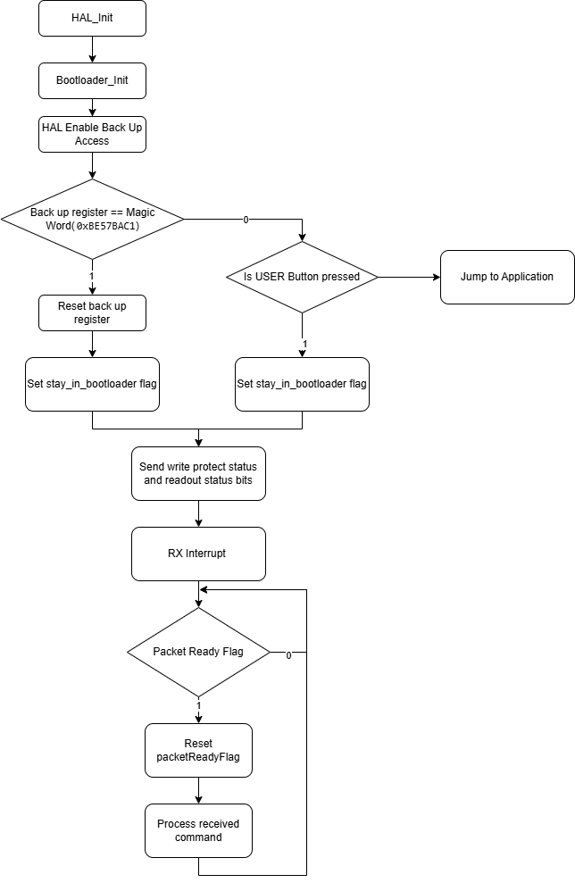
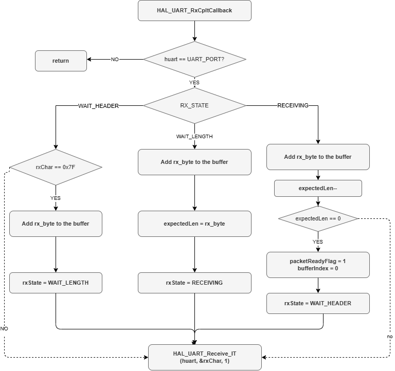

# Bootloader-Course

STM32F4 serisi mikrodenetleyiciler için geliştirilmiş özel bir bootloader projesidir. STM32 tarafındaki C diliyle, bilgisayar tarafındaki arayüz ise C# ile yazılmıştır. İkisi arasındaki haberleşme UART üzerinden özel bir paket protokolüyle sağlanmaktadır.

---

## İçindekiler

- [Proje Yapısı](#proje-yapısı)
- [Donanım](#donanım)
- [GUI Ekran Görüntüsü](#gui-ekran-görüntüsü)
- [Desteklenen Komutlar](#desteklenen-komutlar)
- [Haberleşme Protokolü](#haberleşme-protokolü)
- [STM32 Yanıt Formatları](#stm32-yanıt-formatları)
- [Application to Bootloader](#application-to-bootloader)
- [Akış Diagramları](#akış-diagramları)
- [Kaynak](#kaynak)

---

## Proje Yapısı

```
Bootloader-Course/
├── Bootloader Workspace/   
    ├──F4_Application/
    └──F4_Bootloader/
└── STM32F4Flasher/
```

---

## Donanım

- STM32F407G-DISC1
- USB-UART dönüştürücü (Harici bir dönüştücüye sahip olunmadığından ARDUINO UNO içerisindeki CH340 mödülü dönüştürücü olarak kullanılmıştır.)

### ARDUINO UNO USB TO TTL DÖNÜŞTÜRÜCÜ OLARAK KULLANILMASI

Arduino UNO'nun USB-TTL dönüştürücü olarak kullanılabilmesi için öncelikle kart üzerindeki ana işlemci (ATmega328P) devre dışı bırakılmıştır. Bu işlemi gerçekleştirmek amacıyla **Arduino'nun RESET pini GND'ye çekilmiş**, böylece kart üzerindeki USB-Seri dönüştürücü entegresinin (CH340) doğrudan kullanılmasına imkan sağlanmıştır. Ayrıca, UART haberleşmesinin sağlıklı bir şekilde çalışabilmesi için hedef cihaz olan **STM32 ile Arduino'nun GND (toprak) hatları birleştirilerek ortak referans noktası oluşturulmuştur.**

Standart UART haberleşmesinde cihazlar arası bağlantılar çapraz (TX → RX) yapılmalıdır. Ancak Arduino kartı üzerinde yer alan USB-Seri dönüştürücü çip ile ana işlemci arasındaki PCB hatları halihazırda çapraz olarak tasarlandığından, kart USB-TTL olarak kullanılırken harici cihazla düz bağlantı kurulması gerekmektedir. Bu donanımsal tasarımdan dolayı STM32 ile Arduino arasındaki bağlantılar aşağıdaki şekilde yapılmıştır:

- STM32 RX → Arduino RX
- STM32 TX → Arduino TX

### Voltage Uyumsuzluğu

Kullanılan USART1_RX pini FT(Five Volt Tolerant) (Table 11: maksimum gerilim Vdd+4) olması rağmen Arduinodan gelen 5V logic input değerini alamadığı için RX pinine giden input gerilimi bir gerilim bölücü kullanılarak 3.3V düşürüldü. 

Kullanılan Gerilim bölücü devre:



---

## GUI Ekran Görüntüsü



---

## Desteklenen Komutlar

Bootloader ile bilgisayar arayüzü arasındaki haberleşme aşağıdaki komut seti üzerinden sağlanır. Her komut özel bir hex kodu ile temsil edilir.

| Komut | Hex Kodu | Açıklama |
|---|---|---|
| `GET_HELP` | `0x00` | Bootloader versiyonunu ve desteklenen tüm komutların hex kodlarını döndürür. |
| `GET_VERSION` | `0x01` | Cihazda çalışan bootloader'ın versiyon numarasını okur. |
| `GET_ID` | `0x02` | Hedef mikrodenetleyicinin chip ID'sini okur. STM32F407 için bu değer `0x413`'tür. |
| `READ_MEMORY` | `0x11` | Belirtilen başlangıç adresinden istenilen uzunlukta veri okur. |
| `GO_TO_ADDRESS` | `0x21` | Mikrodenetleyicinin belirtilen bellek adresine atlamasını ve oradaki kodu çalıştırmasını sağlar. |
| `WRITE_MEMORY` | `0x31` | Belirtilen bellek adresine yeni veri yazar. Veriler paketler halinde gönderilir. |
| `ERASE` | `0x43` | Flash bellekteki belirtilen sektörleri siler veya tüm belleği temizler (Mass Erase - `0xFF`). |
| `CONNECT` | `0x62` | Cihazın bootloader modunda olup olmadığını kontrol eder. Başarılı bağlantıda mevcut WRP ve RDP koruma durumlarını bildirir. |
| `WRITE_PROTECT_UNPROTECT` | `0x63` | Flash bellekteki belirli sektörler için yazma korumasını (WRP) aktif eder veya kaldırır. |
| `JUMP_TO_BOOTLOADER` | `0x79` | Cihaz normal uygulama modundayken sistemi sıfırlayarak bootloader moduna geçmesini tetikler. |
| `READOUT_PROTECT_UNPROTECT` | `0x82` | Mikrodenetleyicinin okuma koruması (RDP) seviyesini ayarlar. Seviye 0: korumasız, Seviye 1: korumalı, Seviye 2: kalıcı korumalı. |
| `EXIT` | `0x89` | Bootloader modundan çıkar, sistemi sıfırlar (reset) ve ana uygulamaya geçiş yapar. |

> `GET_CHECKSUM (0xA1)` komutu tanımlanmış ancak STM32 tarafındaki `switch-case` yapısında henüz implement edilmemiştir.

---

## Haberleşme Protokolü

PC (C# arayüzü) ile STM32 bootloader arasındaki haberleşme UART üzerinden özel bir paket yapısı üzerinden gerçekleşir.

### Genel Frame Yapısı (PC → STM32)

| Alan | Boyut | Açıklama |
|---|---|---|
| Header | 1 byte | Sabit değer: `0x7F` |
| Length | 1 byte | Gönderilen verinin toplam uzunluğu |
| Command | 1 byte | Komutun hex kodu |
| Payload / Data | N byte | İsteğe bağlı veri veya adres |
| CRC8 | 1 byte | Veri/adres doğrulaması |

> PC arayüzü her iletimin sonuna `\r` ve `\n` karakterlerini ekler. Bootloader bu bitiş karakterlerini tolere edecek şekilde tasarlanmıştır.

---

### 1. Basit Komutlar

`GET_HELP`, `GET_VERSION`, `GET_ID`, `CONNECT`, `EXIT` gibi ek veri gerektirmeyen komutlardır. CRC değeri `Length + Command` üzerinden hesaplanır.

**TX (PC → STM32):**
```
[0x7F] [0x03] [CMD] [CRC8]
```

**RX — GET_HELP:**
```
[0x79] [Komut Sayısı] [Bootloader Ver] [Cmd1] [Cmd2] ...
```

**RX — CONNECT:**
```
[0x79] [WRP High] [WRP Low] [RDP Status]
```

---

### 2. READ_MEMORY (0x11)

Belirtilen bellek adresinden veri okumak için kullanılır. Güvenlik için okuma uzunluğunun complementi de gönderilir.

**TX (PC → STM32):**
```
[0x7F] [0x0A] [0x11] [Adres (4 Byte)] [CRC8_Adres] [Uzunluk N] [~N]
```

**RX — Başarılı:**
```
[0x79] [Data1] [Data2] ... [DataN]
```

**RX — Hata:**
```
[0x1F]
```

---

### 3. WRITE_MEMORY (0x31)

Dosya boyutuna göre bloklar 64 bytelık veriler halinde yazılır. Adres ve veri kısımları için iki ayrı CRC doğrulaması yapılır.

**TX (PC → STM32):**
```
[0x7F] [Uzunluk] [0x31] [Adres (4 Byte)] [CRC8_Adres] [Yazılacak Byte - 1] [Toplam Dosya Boyutu (4 Byte)] [Veri Bloğu (N Byte)] [CRC8_Veri]
```

**RX:**
```
[0x79]  →  ACK, işlem başarılı
[0x1F]  →  NACK, hatalı adres veya CRC uyuşmazlığı
```

---

### 4. GO_TO_ADDRESS (0x21)

Yüklenen uygulamayı başlatmak için belirtilen bellek adresine (örn. `0x08008000`) atlama komutudur.

**TX (PC → STM32):**
```
[0x7F] [0x06] [0x21] [Adres (4 Byte)] [CRC8_Adres]
```

**RX:**
```
[0x79]  →  ACK gönderir ve hemen ardından belirtilen adresten kodu çalıştırmaya başlar.
```

---

### 5. ERASE (0x43)

Seçilen sektörleri veya tüm flash belleği silmek için kullanılır. `0xFF` değeri Mass Erase tetikler. Ancak mass erase bootloader kodunun buunduğu (ilk 800 byte) sektörleri silmez.

**TX (PC → STM32):**
```
[0x7F] [Sektör Sayısı + 3] [0x43] [Sektör Sayısı] [Sektör_1] ... [Sektör_N] [CRC8]
```

**RX:**
```
Silinen her sektör için sırayla [0x79] döner.
```

---

### 6. WRITE_PROTECT / READOUT_PROTECT

**Write Protect TX:**
```
[0x7F] [0x06] [0x63] [Sektör Sayısı] [WRP High Mask] [WRP Low Mask] [CRC8]
```

**Readout Protect TX:**
```
[0x7F] [0x03] [0x82] [RDP Seviyesi (0xAA, 0xBB veya 0xCC)] [CRC8]
```

**RX:**
```
[0x79]  →  İşlem başarılı. Cihaz koruma ayarlarını uygulamak için OB_Launch ile kendini yeniden başlatır.
```

---

## STM32 Yanıt Formatları

Bootloader alınan her komutun CRC değerini, adres geçerliliğini (Flash veya SRAM sınırları içinde mi?) ve komut bütünlüğünü kontrol eder.

| Değer | Anlam | Açıklama |
|---|---|---|
| `0x79` | ACK | Komut geçerli, CRC doğrulandı, işlem başarılı. Ek veri gönderilecekse ACK'nin hemen arkasına eklenir. |
| `0x1F` | NACK | CRC uyuşmazlığı, yetkisiz bellek adresi veya hatalı işlem. |
| `0x99` | UNKNOWN | Bilinmeyen veya desteklenmeyen bir komut kodu gönderildi. |

---

## Application to Bootloader

Normalde bootloader moduna geçmek için USER butonuna basılı tutup cihazı power up yapmak gerekir. Fiziksel müdahale olmadan yazılımsal olarak geçiş yapabilmek için ise PC arayüzünden `USART1` üzerinden `[0x7F] [0x79] [\r] [\n]` komut dizisi gönderilir. Application tarafında bu diziyi yakalayan bir state machine (`HEADER → CMD → TERMINATE → NEW_LINE`) çalışır; dizi tamamlandığında `GoToBootloader_Command_Received()` çağrılır, reset'ten etkilenmeyen `RTC Backup Register 1`'e Magic Word (`0xBE57BAC1`) yazılır ve `NVIC_SystemReset()` ile cihaz soft reset atılır. Yeniden başlayan sistem bootloader'a düşer; bootloader Backup Register'da Magic Word'ü görünce register'ı temizler ve uygulamaya atlamak yerine PC'den komut beklemeye başlar.

---

## Akış Diagramları

### Bootlaader ana döngü akış diagramı



### Bootloader UART RX Interrupt Callback Akış Diagramı



---

## Kaynak

Bu projenin temel kavramları ve çıkış noktası, **Arif Mandal** tarafından **xBowtie** platformunda verilen **STM32 ile Kendi Bootloader'ını (Önyükleyici) Geliştir!** kursuna dayanmaktadır.
